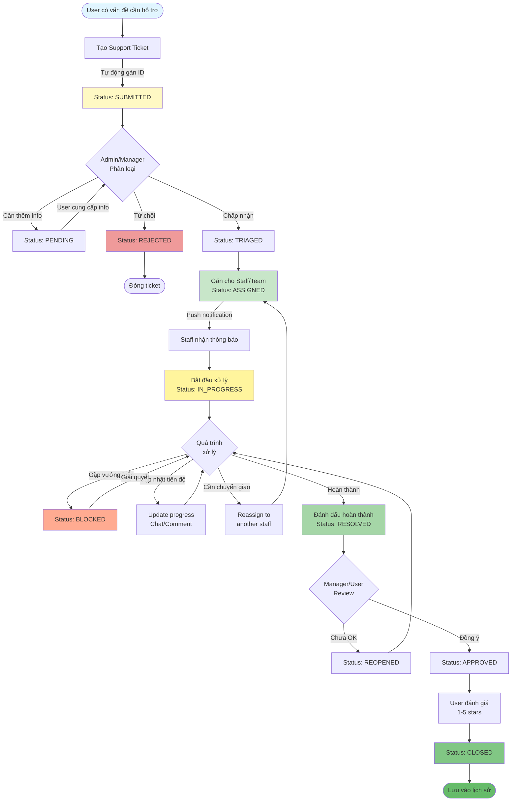
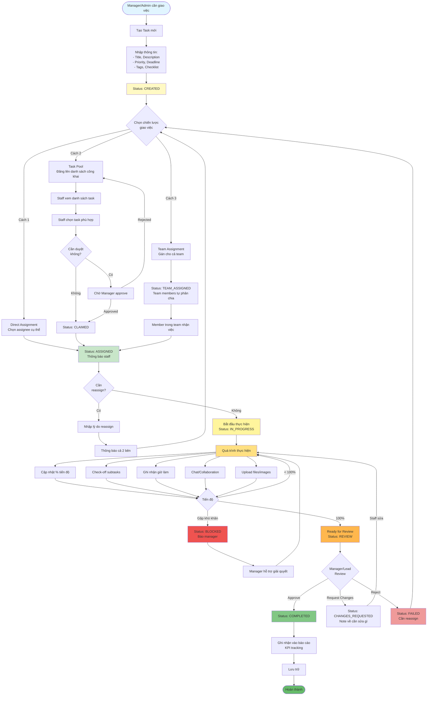
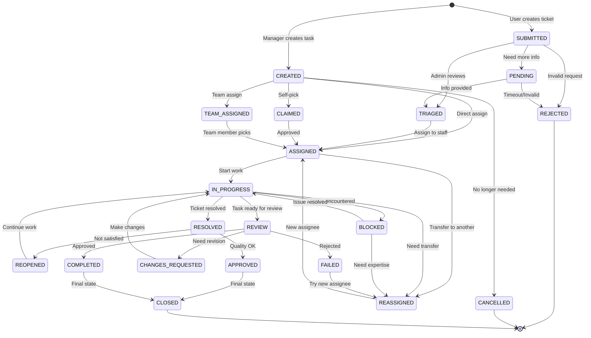
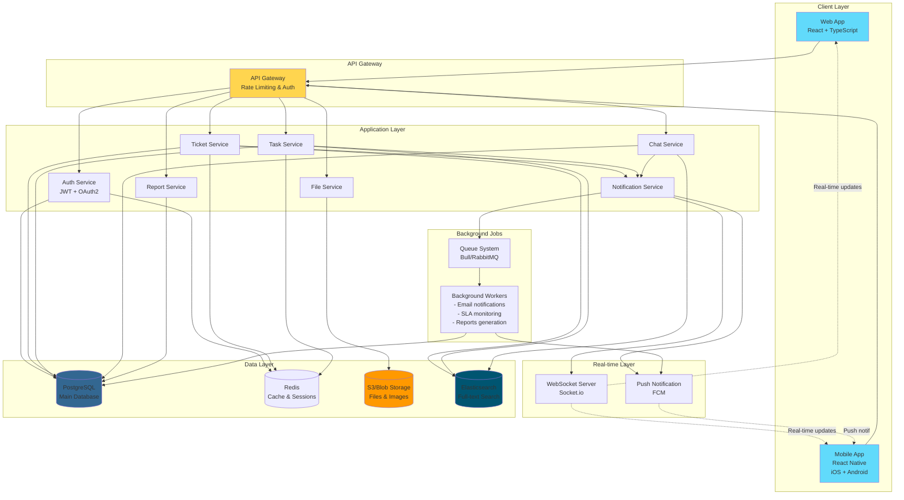
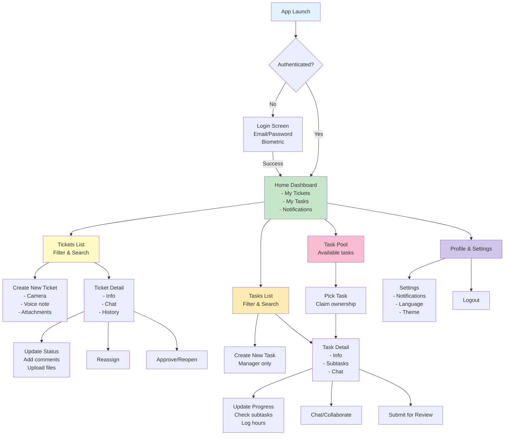
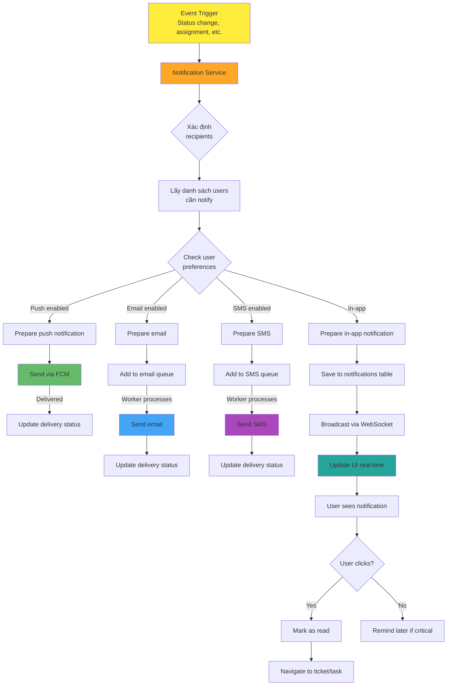
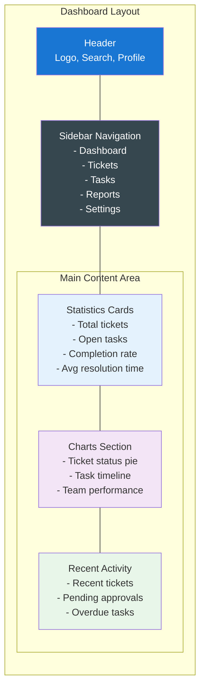
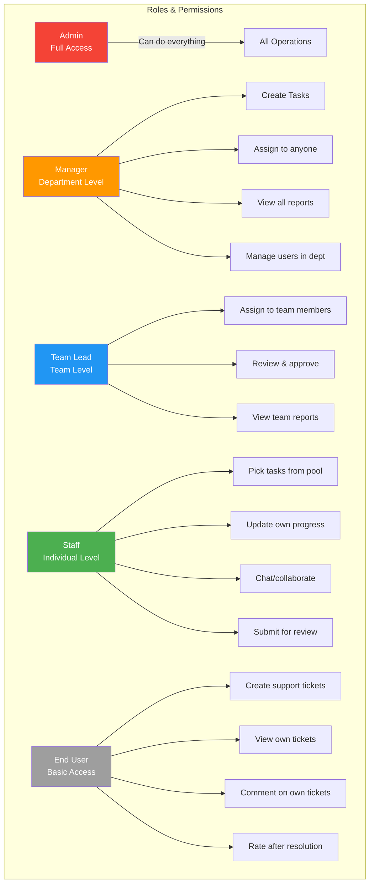
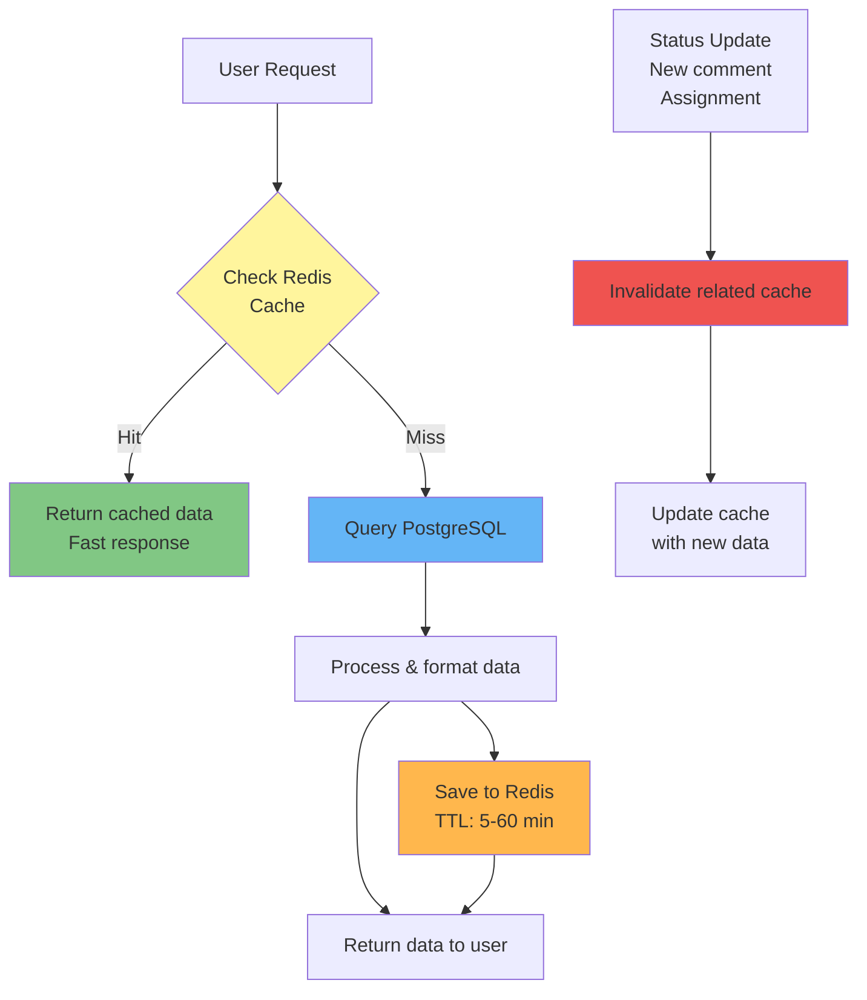
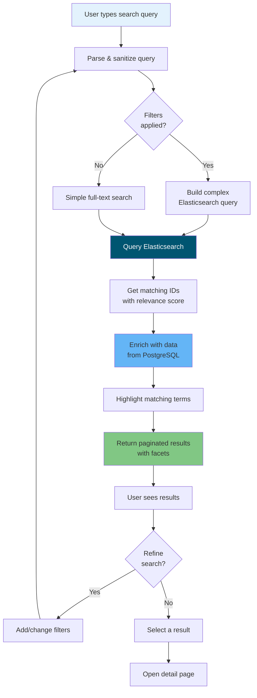

# Workflow Diagrams - Hệ Thống Quản Lý Công Việc Y Khoa

## 📊 WORKFLOW 1: SUPPORT TICKET MANAGEMENT

### Sơ đồ chi tiết luồng xử lý ticket

---

## 📋 WORKFLOW 2: TASK ASSIGNMENT & MANAGEMENT

### Sơ đồ chi tiết luồng giao việc và quản lý task

---

## 🔄 STATUS FLOW DIAGRAM

### Tổng quan luồng trạng thái

---

## 🏗️ SYSTEM ARCHITECTURE

### High-level architecture diagram

---

## 📱 MOBILE APP SCREEN FLOW

### Navigation flow cho mobile app

---

## 🔔 NOTIFICATION FLOW

### Hệ thống notification tự động

---

## 📊 DASHBOARD LAYOUT

### Web dashboard structure

---

## 🎯 USER ROLE PERMISSIONS MATRIX

---

## ⚡ PERFORMANCE OPTIMIZATION

### Caching strategy

---

## 🔍 SEARCH OPTIMIZATION

### Search flow with Elasticsearch

Bạn có thể copy các diagram này vào bất kỳ Markdown viewer nào hỗ trợ Mermaid để xem visualization!
